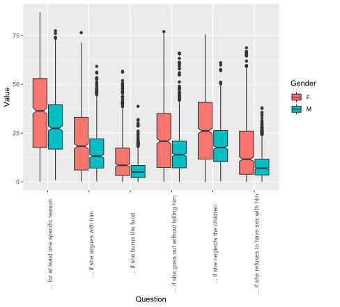
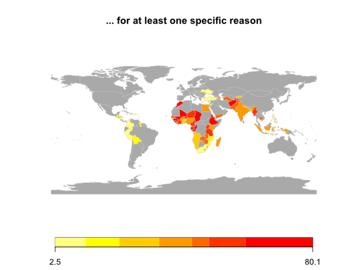
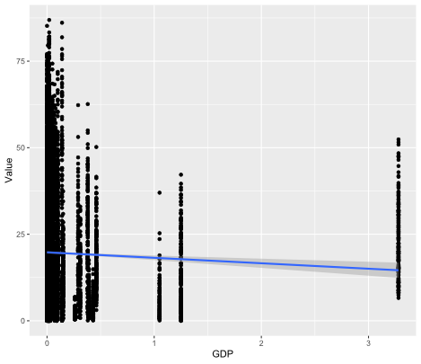
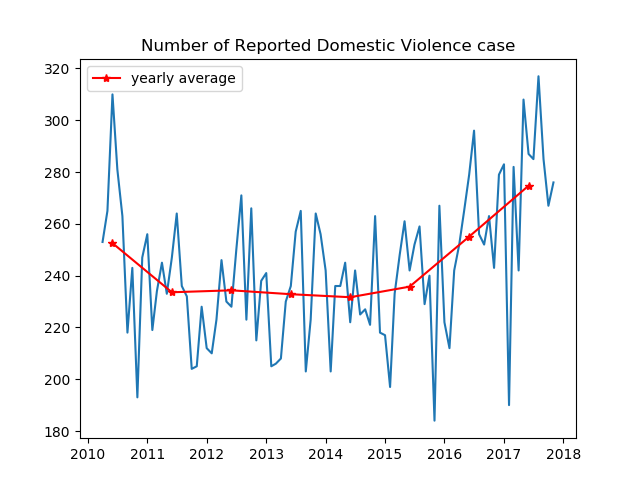
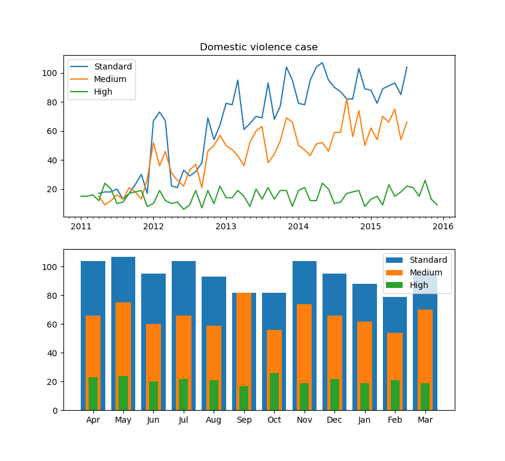

# Report on WAI hackathon 2021

### Team members (by alphabetical order, women first):

- Prima Anugerahanti (Indonesia)
- Heather Ritchie (Scotland)
- Gerlien Verhaegen (Belgium)
- Ettore Barbieri (Italy)
- Arthur Bauville (France)


### Content:
1. #### [Introduction](#Intro)
1. #### [Dataset 1](#Data_1)
    1. #### [Description of the dataset](#Data_1.1)
    1. #### [Exploratory data analysis](#Data_1.2)
    1. #### [Modeling attempt](#Data_1.3)
1. #### [Dataset 2](#Data_2)
    1. #### [Description of the dataset(s)](#Data_2.1)
    1. #### [Exploratory data analysis](#Data_2.2)
    1. #### [Future analyses](#Data_2.3)
1. #### [Summary](#Summary)


<a id="Intro"></a>
# 1. Introduction

For this competition, our team met on February 20, 2021. All team members are researchers at the Japan Institute for Marine-Earth Sciences and Technology (JAMSTEC). Since we could only spend one day together for the competition our objectives were: 

- to raise our own awareness about domestic abuse and gender inequality
- to test our data analysis skills
- to get familiar with this data problem, attempt to formulate questions and design strategies to tackle those questions.

We tried to exploit two datasets: the Viz5/MakeOverMonday questionnaire on domestic abuse (later, "dataset 1"), and the dataset of reports of domestic violence to the city of York (later, "dataset 2"). 
Since we alotted ourselves only one day of work, we focused on exploratory data analysis. We also attempted statistical modeling but faced a number of interesting road blocks for which we managed to design workarounds but we didn't have time to implement it.

<a id="Data_1"></a>
# 2. Dataset 1

<a id="Data_1.1"></a>
## 2.1. Description of the dataset

Dataset 1 summarizes the results of a questionnaire where participants were asked whether they agree or disagree to the following statements:

-A husband is justified in hitting or beating his wife if she burns the food
-A husband is justified in hitting or beating his wife if she argues with him
-A husband is justified in hitting or beating his wife if she goes out without telling him
-A husband is justified in hitting or beating his wife if she neglects the children
-A husband is justified in hitting or beating his wife if she refuses to have sex with him
-A husband is justified in hitting or beating his wife for at least one specific reason

The dataset includes the percentage of positive answers depending on categories of the following demographical features:
– marital status, education level, employment status, residence type, or age

<a id="Data_1.2"></a>
## 2.2. Exploratory data analysis

Here, we tried to answer a few questions.
**Q1: To which statement did people agree and disagreed the most for which it is justified to hit or beat the wife?**
**A1: Overall, the most agreed statement was: “for at least one specific reason”, the least agreed statement was: “if she burns food” (Fig. 1).**


**Q2: Were men or women most likely to agree that it was justified to hit or beat the wife?**
**A2: Women always significantly agreed more than men that it was justified to hit or beat a wife for any statement (Fig. 1)**


**Fig. 1** Difference in value (i.e., the percentage of people agreeing that it was justified to hit or beat a wife) per statement (i.e., question) and per gender (F = female, M = male). Significant differences are illustrated by non-overlapping notches.


**Code used to produce figure 1 in R:**
```
# to set your work directory to the folder containing the file:
setwd("folder location") 

#load your dataframe
dat <- read.csv( "20200306 Data International Women's Day Viz5 Launch.csv")

# check in dataframe did load properly
head(dat) 

#to get more info on the dataframe
str(dat)

#to upload package (install first if needed)
library(ggplot2) 

#build the boxplot
ggplot(dat, aes(x = Question, y = Value))+
geom_boxplot(aes(fill = Gender),notch=TRUE,las=2)+
theme(axis.text.x = element_text(angle = 90))
```

**Q3: In which countries do people agree the most that "A husband is justified in hitting for at least one specific reason”?**
**A3: South America had the lowest values (i.e., disagreed the most) whereas countries in Africa and Asia the closest to the equator had the highest values (i.e., agreed the most). We were wondering why only countries in these regions took part in the survey.**


**Fig. 2** World map showing the value (i.e., the percentage of people agreeing that it was justified to hit or beat a wife)for the statement “for at least one specific reason” for each country that took part in the survey. Countries in grey did not take part in the survey.

**Code to produce figure 2 in R:** (for setting work directory and loading dataframe, see code above)
```
#load package
library(rworldmap)

#subsample the dataframe with only entries for the question “…for at least one specific reason”
datq <- subset(dat,dat$Question=="... for at least one specific reason")

#build map
sPDF <- joinCountryData2Map(datq, joinCode='NAME', nameJoinColumn='Country')

mapCountryData (sPDF, nameColumnToPlot='Value',missingCountryCol='darkgrey',mapTitle ="... for at least one specific reason")
```

**Q4: Are positive answers to the statement  "A husband is justified in hitting for at least one specific reason” correlated with the Gross Domestic Product (GDP)?**
**A4: There is a slight correlation (Kendall's rank correlation tau, tau = -0.104999, z = -15.676, p-value < 2.2e-16) with the percentage of people agreeing that it was justified to hit or beat a wife correlated and the GDP of these countries, with countries having the highest share of world GDP to disagree the most with all statements (Fig. 3).**



**Fig. 3** Scatter plot of the value (i.e. Positive answer to the statement "A husband is justified in hitting for at least one specific reason”) versus the share of world GDP (in percentage) of the countries that participated in the survey.


**Code for figure 3:**
```
# we first added an additional column in the dataframe with the share of World GDP we found online (https://www.worldometers.info/gdp/gdp-by-country/)
# check if data is normally distributed to know which correlation test to use
shapiro.test(dat$Value)

#the data “Value” was not normally distributed, so we applied a non-parametric correlation test
cor.test(dat$GDP, dat$Value, method="kendall")

#built the plot
library(ggplot2)

plot(x=dat$GDP,y=dat$Value)
ggplot(dat, aes(x=GDP, y=Value))+ 
geom_point()+
geom_smooth(method=lm)
```


<a id="Data_1.3"></a>
## 2.3. Modeling attempt</p>

A challenge for building a predictive model using this dataset is that the dataset does not include the answer and demographic features of each individual person who took the questionnaire (i.e., raw data). Instead, the data provided was agglomerated as percentage of "yes" for e.g. male or female; or the percentage of "yes" for people with "no", "primary", "secondary", or "higher" education level. We tried to use compound statistics to profile people who are most likely to answer "yes" to the given statement. In other terms we wanted to build a new dataset where one could ask: "if we pick at random a person that answered "yes", what is the probability that he is a highly educated man between 25-34 years old". To do this we tried to apply compound probability to combine the different statistics. The problem we faced is that the data we need was "how many percent of people answered yes", combined with "among the persons who answered yes, what is the percentage of people with low/medium/high education". However, to transform the available data to the data we wanted we would have needed at least the number of people from which the percentage was calculated (i.e., number of samples) for each "Demographics Question". In the absence of this data one could either get the raw data or attempt to approximately reconstruct this information from other datasets e.g., of demographics, education etc... Unfortunately we didn't have time to finish this analysis.

<a id="Data_2"></a>
# 3. Dataset 2

<a id="Data_2.1"></a>
## 3.1. Description of the dataset(s)

Dataset 2 (**kpi-domv9a-medium.csv**) documents the number of medium risk domestic violence incidences recorded from 2011-2015 in the City of York, United Kingdom. The number of incidences is recorded on a monthly basis but also summarised by financial quarterlies and by financial year. 

As the provided dataset only documented information on ‘medium risk’ incidences we decided to supplement this dataset with other publicly available datasets from data.gov.uk. We targeted all data sets on domestic violence within the City of York. _All datasets were accessed 20-FEB-2021_.

Datasets investigated were as follows:
1.	Domestic Violence Incidents Level - Medium Risk (**kpi-domv9a-medium.csv**)
2.	Domestic Violence Incidents Level - Standard Risk (**kpi-domv8a-standard.csv**)
3.	Number of MARAC cases discussed (**kpi-marac01-high-risk.csv**)
4.	Number of domestic violence incidents involving arrest (**kpi-domv2-arrest.csv**)
5.	Domestic Violence Number of Repeat Incidents (**kpi-csp18a-repeat.csv**)
6.	Domestic Violence Occurrence Type - PSW Domestic Incident (**kpi-domv6-psw.csv**)
7.	Number of domestic violence incidents where children present (**kpi-domv4-children-present.csv**)
8.	Domestic Violence Occurrence Type - Crime Violence (**kpi-domv5-crime-violence.csv**)
9.	Domestic Violence Occurrence Type - Other (**kpi-domv7-other.csv**)
10.	Number of Reports of Domestic Abuse Incidents reported to NYP (York only) (**kpi-csp51-domestic-violence-reports.csv**)
11.	Number of domestic violence incidents crimed (**kpi-domv3-incidents-crimed.csv**)
12.	Households accepted as being homeless and in priority need - Domestic Violence (**kpi-hou281a-homeless-priority.csv**)
13.	Residents who agree that York is a safe city to live in, relatively free from crime and violence - Agree (All Responses) (**kpi-bys131-perc-agree-safe.csv**)
14.	All Crime per 1000 population (**kpi-csp01b-all-crime-1000-popn.csv**)
15.	Overall Violence (Violence Against Person Def.) (**kpi-csp15-overall-violence.csv**)
The majority of the datasets were recorded in a similar way, and for a similar time frame as the original data set (**kpi-domv9a-medium.csv**) but there are some exceptions.


<a id="Data_2.2"></a>
## 3.2. Exploratory data analysis
Using these datasets we wanted to examine trends in domestic violence in the City of York. 

**Q1. What is the overall trend in reported domestic violence cases?**

To answer this we plotted the monthly reported cases of domestic violence from 2010 – 2018 and fitted a yearly average.



**Fig. 4** The number of reported domestic violence cases in the City of York, UK. A yearly average line is fitted in red.

**Code used to produce figure 4 in python:**
```
plt.figure()
plt.title('Number of Reported Domestic Violence case')
plt.plot(dates_yr, york_reports.Value)
plt.plot(sm, yealy_ave,'r*', linestyle='-', label='yearly average')
plt.legend(loc='best')
```

**A1. The total number of reported domestic violence cases fluctuates overtime. The number of reports decreases between 2010 and 2011 and remains steady 2016. Between 2016 and 2018 reported  cases of domestic violence increase.**

**Q2. Are there any temporal trends in the reporting of standard, medium and high (aka MARAC) cases?**

To investigate this question we examined the data in two ways. Firstly, we plotted the number of reported cases for each month that was available in each of our three categories (standard, medium and high) to determine whether the reporting patterns were similar or dissimilar. Secondly, we grouped the available data for each category by month to examine any seasonality in reporting patterns.



**Fig. 5** Data on reported domestic violence cases in the City of York, UK. Top panel shows the monthly reported incidences from 2011-2016 for three risk categories; standard, medium and high. Bottom panel shows the summed values for each risk category by month. 

**Code used to produce figure 5 in python:**
```
plt.figure()
ax=plt.subplot(211)
plt.title('Domestic violence case')
ax.plot(dates_ys, reported_case_ys, label='Standard')
ax.plot(dates_yd, reported_case, label='Medium')
ax.plot(dates_hs, york_hfilt.Value, label= 'High')
ax.legend(loc='best')
ax.xaxis.set_major_locator(years)
ax.xaxis.set_major_formatter(years_fmt)
ax.xaxis.set_minor_locator(months)

plt.subplot(212)
width=0.5
p1= plt.bar(york_s_rawfilt.Period, reported_case_ys, label= 'Standard')
p2= plt.bar(york_data.Period,reported_case, width, label= 'Medium' )
p3= plt.bar(york_hfilt.Period, york_hfilt.Value, 0.3, label= 'High')
plt.legend(loc= 'best')
```

**A2. Between 2011 and 2016 the number of standard and medium risk domestic violence cases have increased but high risk cases have remained relatively stable. There is no pattern in the number of reported cases by month.**


<a id="Data_2.3"></a>
## 3.3. Future analyses

As we were limited on time we did not get to explore all the datasets. If we had more time some of the questions we would have tried to answer were:

**Q3. Does the number of reported cases of domestic violence reflected a wider trend in reported cases of crime in general?**

**Q4. What are the trends for the types of domestic violence crimes committed? (e.g., ‘violent’ v ‘other’.)**

**Q5. Does the number of reported cases of domestic violence increase when there is an increase in homelessness?** 

**Q6. Does the increase in "standard" and "medium risk" reports reflect an increase of domestic violence cases, or an rather an increase in the action of reporting ? If the latter is true, then actually violence may actually be constant while women feel more open to report to the police.** 

<a id="Summary"></a>
# 4. Summary

Domestic violence is still a major problem in the world. This event opened our eyes on the discrepancy in the geopgrahical repartition of domestic violence (dataset 1). A suprising fact was that women see violence against them justified more often than men do. Secondly, reports of domestic violence in the city of York were multiplied by five between 2011 and 2018 for "standard" and "medium risk". Further analyses of the York dataset may reveal whether the increase in reports correspond to an increase in domestic violence or, hopefully, an increase in the openness and trust in the police system.