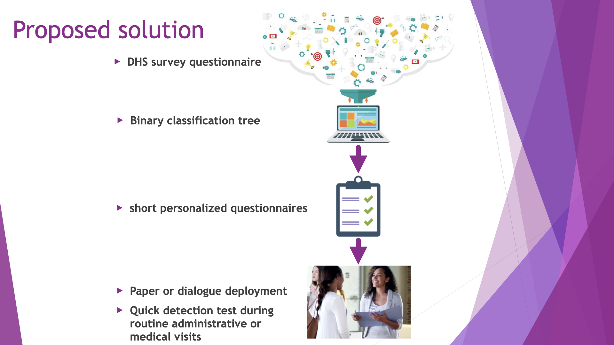

# Winner submission to Wai datathon 2021

This repository contains material related to our submission for the WaiDatathon 2021 where we earned the first place 🥇.
This datathon was organized by Women in AI on the theme ["Combat Domestic Violence with Data & AI"](https://www.womeninai.co/waidatathon-details). We proposed a machine learning model that creates a questionnaire to detect early signs of domestic violence. Because the model can be deployed on paper or by dialogue, it is especially suited for developing countries. We used the amazing data from The Demographic and Health Surveys (DHS) Program. You can watch our 5-minute competition talk [here](https://lnkd.in/gBupkte), or a 15-minute extended talk we gave for the [Machine Learning Tokyo](https://github.com/Machine-Learning-Tokyo) community [here](https://www.youtube.com/watch?v=nO7Y22k9otg).

## Content

This repository contains:

- `Presentation_Wai_Finals.pdf`: slides of our presentation at the WaiDatathon event
- `Presentation_MLT`: slides of our presentation for [Machine Learning Tokyo](https://github.com/Machine-Learning-Tokyo).
- `report.ipynb`: a python3 jupyter notebook report that summarizes our findings and reproduces the results. The report contains in slightly different results than competition presentation for a few reasons:

    - data copyright
    - some competition figures were produced with R instead of python
    - some competition figures layout was edited in a vector graphics software
    - we added some figures or made existing ones interactive.
- `./Data/`: 
    - `ZZIR62FL.*`: the model dataset from the [DHS program](dhsprogram.com)
    - `DHS_summary_world.csv` data generated using the DHS [STATcompiler](STATcompiler.com) tool.
    - `iso_alpha_list.csv`: list ISO_ALPHA_3 standard country codes (for visualization).

## Team

- [Arthur Bauville (leader)](https://www.linkedin.com/in/arthur-bauville-a734871ba/)
- [Gerlien Verhaegen](https://www.linkedin.com/in/gerlien-verhaegen-695b4868/)
- [Prima Anugerahanti](https://www.linkedin.com/in/prima-anugerahanti-248b17a1/)
- [Heather Ritchie-Parker](https://www.linkedin.com/in/heather-ritchie-b3483476/)
- [Ettore Barbieri](https://www.linkedin.com/in/ettorebarbieri/)