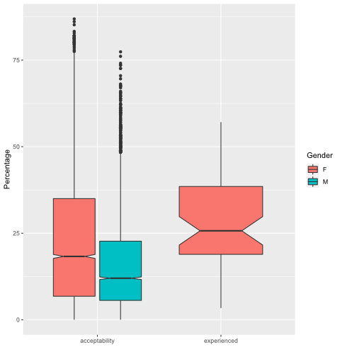

# Domestic violence: risk factors and diagnostic using explainable AI

## 1. Introduction: domestic violence and its perception

Text and figure: **Heather**
key points:

- Our perception of domestic violence: is it acceptable? am I likely to be victim of it?
- Reality of numbers

**Fig. 1.** Combines the  evolution of perception of the likelihood of being victim of a crime in the UK (decreasing trend in time), and the York reports (increasing trend in time)

## 2. Acceptability vs. experienced domestic violence worldwide

Text and figure: **Gerlien**

**acceptability** = percentage of people agreeing it was justified to hit or beat a wife “for at least one specific reason”
**experienced** = the percentage of ever married women who have ever experienced physical or sexual violence committed by their husband or partner

For all tested countries:

Answers to the questions "Is it acceptable to beat you wife if..."

**Fig. 2** Summary figure combining a map and relevant bar charts (or other types of charts) showing general trends

## 3.Does your view on acceptability influence your likelihood of experience domestic violence?

Data preprocessing: **Arthur*:
Text and figure: **Ettore**

**Fig. 3.** bar (or other) charts of acceptance vs experience of violence

key points:

- we use two questions from the DHS program full questionnaire: the previous question on the acceptability of violence and another one on actual experience of violence
- women who answered no to all the questionnaire questions are ~twice less likely to experience physical domestic violence.
- no matter views on acceptability or level of education, the probability is always higher than 0. Therefore, we in the next sections we identify risk factors and we propose a diagnosis tool

## 4. Risk factors
data processing: **Prima and Arthur**
plotting and text: **Prima**

key points: 
- we quantify how much knowledge of demographics, belief, wealth, wife and husband habit etc... control whether a woman is experiencing violence

## 5. Diagnosing risks domestic violence
**Arthur**

key points: 

- We use a transparent AI technique (i.e. transparent in the sense of NOT a black box) to determine which question should one ask herself in order to identify red flags in her situation that may indicates that the relationship could evolve towards violence
- The output is a small decision tree, that can be implemented in software or printed on paper
- At each step of the tree we can indicate whether the respondent is more likely or less likely to experience violence than the general population.

## 6. Conclusion
